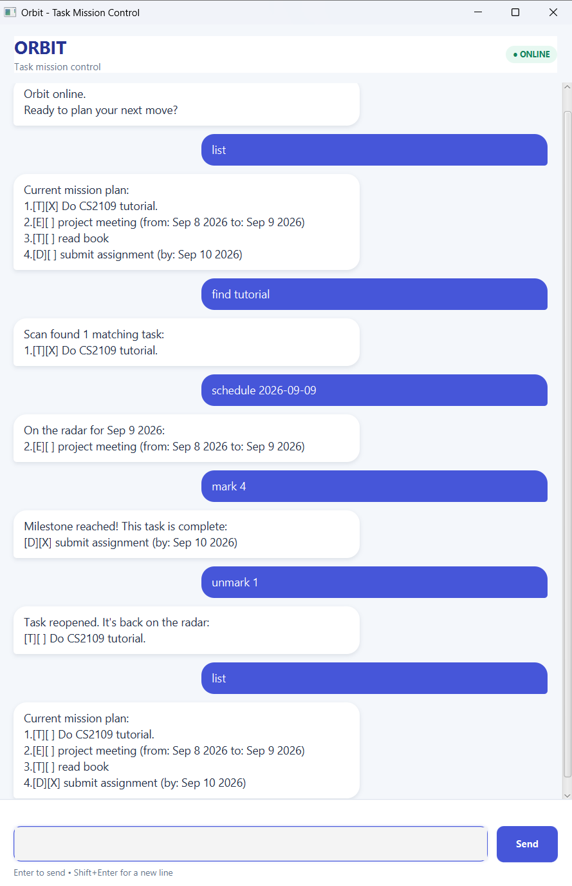

# Orbit User Guide

Orbit is a mission-control-themed task manager. It accepts short text commands through
either its JavaFX window or command-line interface and saves successful changes automatically.



## Quick start

1. Start Orbit using `./gradlew run` on macOS/Linux or `.\gradlew.bat run` on Windows.
2. Type a command in the input box.
3. Press Enter or select **Send**. Use Shift+Enter to insert a line break.
4. Enter `bye` when you are finished.

Dates must use the `yyyy-MM-dd` format, such as `2026-09-16`.

## Command summary

| Action | Command |
|---|---|
| Add a Todo | `todo DESCRIPTION` |
| Add a Deadline | `deadline DESCRIPTION /by DATE` |
| Add an Event | `event DESCRIPTION /from START_DATE /to END_DATE` |
| List tasks | `list` |
| Mark a task complete | `mark NUMBER` |
| Reopen a task | `unmark NUMBER` |
| Delete a task | `delete NUMBER` |
| Find tasks | `find KEYWORD` |
| Show a date's schedule | `schedule DATE` |
| Sort tasks | `sort` |
| Exit Orbit | `bye` |

## Adding tasks

Add a task without a date:

```text
todo read book
```

Add a task with a due date:

```text
deadline submit report /by 2026-09-20
```

Add an event covering an inclusive date range:

```text
event project workshop /from 2026-09-20 /to 2026-09-22
```

Orbit rejects missing descriptions, missing or repeated date markers, nonexistent dates,
and events whose end date is earlier than their start date.

## Viewing and changing tasks

Enter `list` to show all tasks with their current numbers. Use those numbers with the
following commands:

```text
mark 2
unmark 2
delete 2
```

Task numbers are validated before the list is changed. If a number is missing, not numeric,
or outside the current list, Orbit displays a navigation alert and continues running.

## Finding tasks

Enter `find KEYWORD` to search task descriptions. Matching is case-insensitive and accepts
phrases containing spaces.

```text
find project report
```

## Viewing a schedule

Enter `schedule DATE` to show deadlines due on that date and events whose ranges include it.

```text
schedule 2026-09-20
```

Todos do not appear in date schedules because they have no associated date.

## Sorting tasks

Enter `sort` to arrange tasks alphabetically by description. Sorting ignores capitalization,
preserves the relative order of equal descriptions, and saves the new order automatically.

## Saving and recovery

Orbit saves after every successful `todo`, `deadline`, `event`, `delete`, `mark`, `unmark`,
and `sort` command. The data folder and file are created automatically on the first change.

If the data file is missing, Orbit starts with an empty task list. If individual saved records
are blank or malformed, Orbit skips those records and loads the remaining valid tasks. If the
file cannot be read or written, Orbit displays a navigation alert instead of terminating.

## Input and error handling

Orbit accepts leading and trailing whitespace, repeated spaces, tab separators, and command
names in different letter cases. Empty commands, unknown commands, unexpected extra arguments,
invalid dates, duplicated date markers, and invalid task numbers receive specific guidance.
After an input error, the next command can be entered normally.

## Exiting

Enter `bye` to close Orbit gracefully:

```text
Orbit signing off. Keep moving forward!
```
